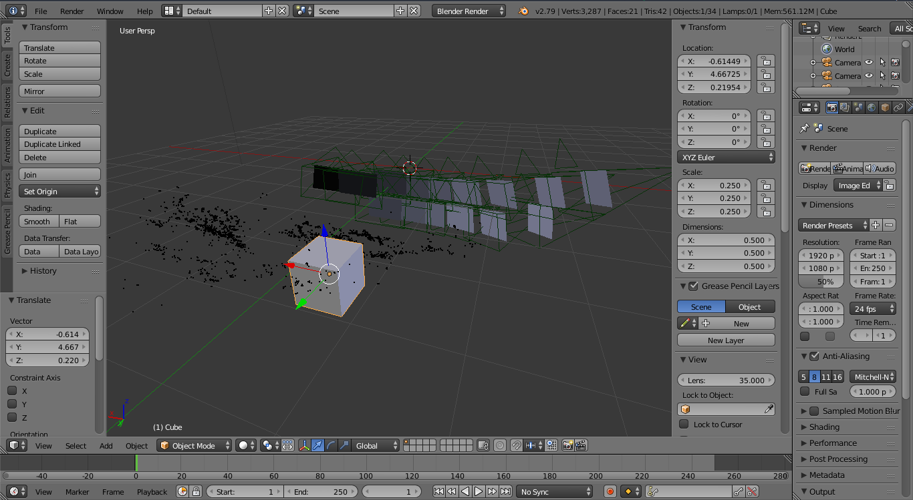
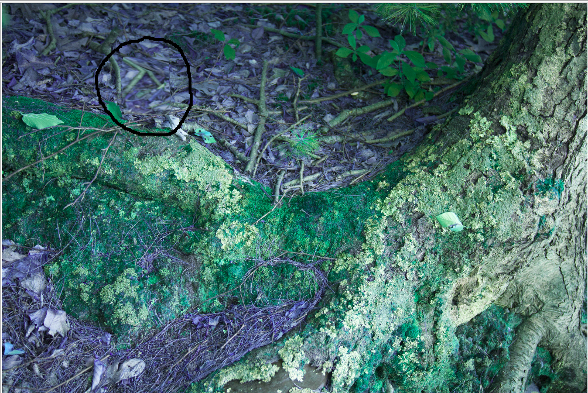

# Camouflaging
Camouflage a cube in a 3D-scene

It is part of our [Computer Vision](http://www.cse.iitd.ac.in/~suban/COL780/semI-2017-2018//) (COL 780) course project at [IIT Delhi](http://www.iitd.ac.in/).

There is a [paper](http://andrewowens.com/papers/2014_camo.pdf) on the same topic from MIT CSAIL.

We tried to implement the paper along with a user interface to put the object in the scene.

## Objective
To hide an Object from different viewpoints

## Inputs

### 3D Scene
About 10-20 images of the scene are captured before any object is placed.

First to make the 3D reconstruction we have used the state-of-the-art [Bundler](http://www.cs.cornell.edu/~snavely/bundler/).

It is used for estimating Structure from Motion (SfM) for Unordered Image Collections.

### 3D object (Cube)
A cube of small dimension (not sure about the exact range) to be placed in the scene.

For this we used [Blender](https://www.blender.org/) to create the 3D scene.

Then we import the **bundle.out** file to blender. 

Blender doesn't support Bundler file out of the box but I found an amazing script to do so. Its included in the /src/Blender directory.

After it is imported we can place the cube in the scene.

Then to export the vertices of the cube's world coordinates I used Blender's API.

The script /src/Blender/export_vertices.py does the job. 

## Output
Texture to be assigned to each of the faces of the cube. So that if we project that texture to that cube surface it will make it blend with the background more accurately.

We have used interface of [1] to display the output in the browser.

Toggle clicks to put the box in the scene and undo it.

## References
[1] [Camouflaging an Object from Many Viewpoints](http://camouflage.csail.mit.edu/)

[2] [Bundler: Structure from Motion (SfM) for Unordered Image Collections](http://phototour.cs.washington.edu/Photo_Tourism.pdf)

